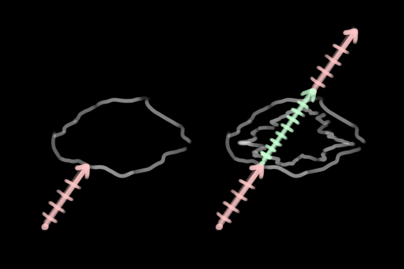
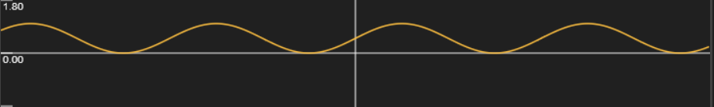
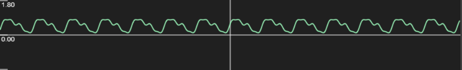
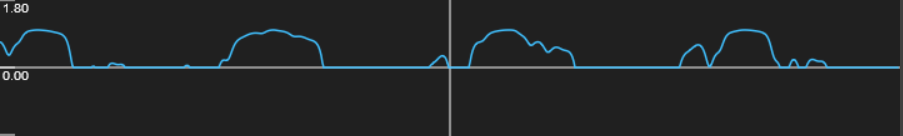
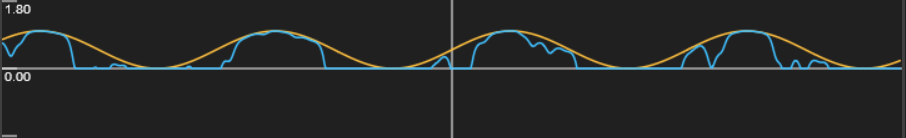
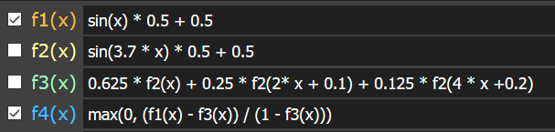
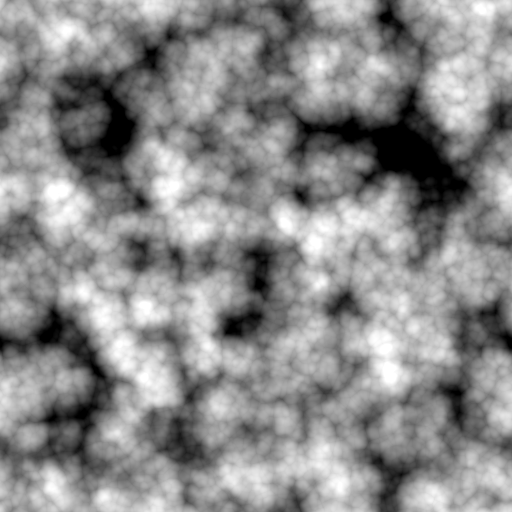
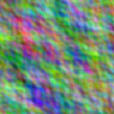
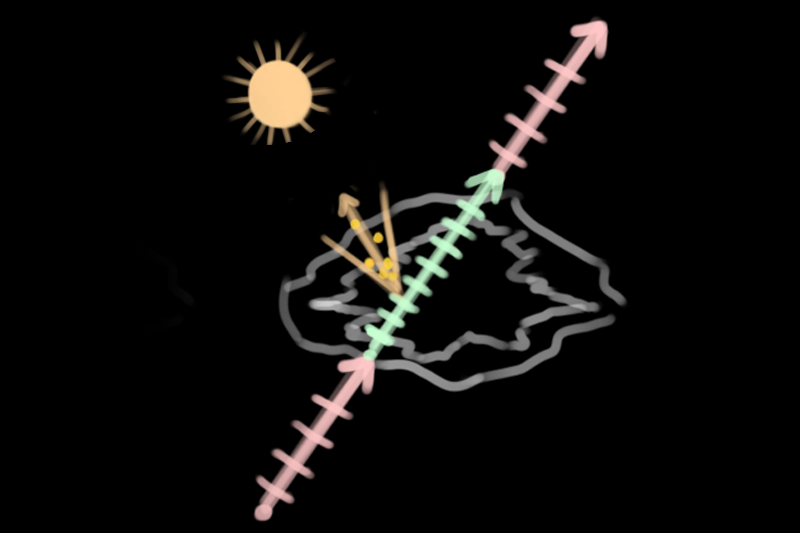
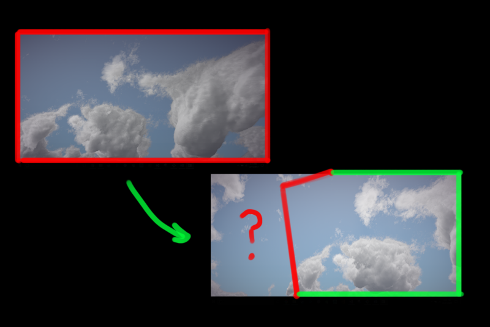

# Project-Marshmallow
Vulkan-based implementation of clouds from Decima Engine

This project is built for 64bit Windows and uses precompiled libs.

# Overview

In 2015 and 2017, the Guerilla Games team released two papers on the real-time rendering of cloudscapes for their game, Horizon Zero Dawn. Project Marshmallow is an implementation of the 2017 paper in C++ and glsl using the new Vulkan API. We wanted to make a cloudscape that runs fast enough for games and interacts with 3D mesh in a scene. We also wanted to learn and properly leverage Vulkan’s new API by making a mixture of compute and graphics pipelines.

# Main Features

- Raymarched, procedural, photorealistic clouds
- Post Processing Framework
- Physical Sky Model
- Procedural Night Sky
- 3D Mesh support - PBR shaders and shadows cast by clouds

## Cloud Raymarching Process

Above: showing the ‘low and high resolution clouds’ and step sizes.

Raymarching is the main purpose of this project, and by far the most computationally expensive feature. Here is the basic outline of the algorithm:

- In a compute shader, cast a ray from the camera to the atmosphere, which is a massive bounding sphere. Also cast the ray to the outer shell of the atmosphere, determining the maximum distance of the ray.
- From the atmosphere, march with a large step, only testing whether the sample point is within a low-resolution cloud. Determining whether a point is within a cloud is described in Cloud Modelling Process.
- If the sample point is within the cloud, go back one step and switch to a smaller step size.
- While on the smaller step size, if the sample point is within a low-resolution cloud, also see if it is within a high-resolution cloud.
- If the sample point is within a high-resolution cloud, also take several lighting samples. This is explained in more detail in Cloud Lighting Process.
- If some number of samples on the smaller step size miss, then return to a lower step size.
- Terminate early if the cloud being sampled is nearly/fully opaque, has reached the outer edge of the atmosphere, or a maximum number of steps.

## Cloud Modelling Process

Our modelling process mostly matches what is described in the paper. But most important to understanding the modelling portion of the paper is the remap function they provide.

Remap(x, mina, maxa, minb, maxb) = (x - mina) / (maxa - mina) * (maxb - minb) + minb

While x is between min and max a, get the relative position between min and max b. This is almost always clamped between min and max b.

Here is the main principle of using this with 1D graphs, plotted in [GraphToy](http://www.iquilezles.org/apps/graphtoy/):

Suppose this orange curve is a representation of our low-resolution cloud density.

Also suppose that this green curve is our high-resolution cloud density. When we remap the low-resolution density with the green curve as the minimum and 1 as the maximum, we get something interesting:

The blue curve is the representation of the final cloud density. Here it is overlaid with the original: 

There are a few big takeaways here:
- Since the low and high resolution density functions are out of phase, we’ve created a series of unique shapes. 
- High-density areas are preserved. Multiplicative or subtractive blending would approach zero density too quickly. 
- The shapes are interesting! Even with these simple representations, there’s a lot of cool variance.

Here are the functions used in this example, for reference: 

Of course, the raymarching is with 3D density fields instead of 1D. The makers of Nubis graciously provided their 3D noise generator as a Houdini digital asset for anyone curious about their method. The noise consists of blends of Perlin and Worley noises.

Above: a texture that helps determine cloud coverage and type.

We modify the density fields in several ways, as described in the 2017 paper:
- Cloud coverage: as coverage goes up, the remapping effect decreases on the low-resolution clouds and the clouds inflate.
- Cloud type: three height-based gradients are defined for nimbus, cumulonimbus, and cumulus clouds. The three are blended and used multiplicatively for the eroded noise.
- Wind: all sample points are offset by a time-based wind. The wind also gains an additional height-based offset.
- Shape Bias: coverage increases with relative height in the atmosphere to make ‘anvil shapes.’ The wind direction also changes slightly.
- Curl Noise: the high-resolution cloud density field alone does not produce the wispiness expected in clouds. We offset this field using a 2D curl noise texture.

Above: a curl noise we generated for this project.

## Cloud Lighting Process

Above: lighting samples are six points within a cone oriented toward the sun.

We implemented the energy attenuation methods described in the 2017 paper. Right now energy starts at 1 and is multiplied with the different attenuation factors towards 0. At the end of the march, the color is just approximated with the sun intensity and color and some of the background color for very opaque clouds.

- Direct lighting: 6 cone samples of density are taken towards the sun and plugged into a modified version of Beer’s law. This is the biggest determinant for the color of the cloud and what imparts directional lighting.
- Henyey-Greenstein: This phase function will darken clouds away from the sun. Two versions of this are blended to get a stronger silver-lining effect towards the sun.
- Inscattering: This is a function of the low-resolution density that creates a darkening effect on the edges. This effect is relaxed over height and strengthened at the bottom of clouds. It creates a “powdered sugar” appearance described in the 2015 paper by another function.

For each step of the raymarch, the normalized energy is alpha blended. 
transmittance = mix(transmittance, newSample, (1.0 - accumulatedDensity))

## Ray Reprojection and Motion Blur

These methods cannot run in real-time without the most important optimization technique outlined in the paper - reprojection of rays.

Raymarching at 1 / 4 resolution (or 1 / 16 pixels) is necessary for our target performance. Reprojection handles the rest. Reprojection attempts to reuse information in the previous framebuffer. In order to decide where on the framebuffer to read, we compute where the current ray would have pointed using the previous frame’s camera state information. Through a quick and cheap sequence of transformations, we can create a ray, find where on the atmosphere it hits, find that point in the old camera space, then get the old direction, and from that the old texture coordinates.

The performance-related consequences of this feature are described in the Performance section of this README.

Of course, there are literal “edge” cases involved with this technique - what do you do when a reprojected ray’s UV coordinate lies outside the bounds of the previous frame buffer? Currently, we simply clamp the UV values to [0, 1), which introduces certain “streaking” artifacts:

which we can make look a little more natural using motion blur:

which looks more reasonable. One potential additional solution to this problem is “overdrawing” the frame, or rendering the image to a framebuffer that is larger than the display window, to ensure that reprojected rays whose UVs would otherwise go beyond 0 or 1 will actually correspond to a correct UV instead of being clamped. We have yet to implement this, however.

## Day and Night Sky

The daytime model is the physical Preetham model. The original implementation is cited in the credits and the source code.
However, the Preetham model does not account for a night sky. For this, we invented a few ways to make (artistic) night textures: https://www.shadertoy.com/view/4llfzj

## Mesh Shadowing

To achieve this, we simply perform a raycast within the mesh fragment shader that is very similar to what is done in the clouds compute shader. We pass along the world space position of the fragment as a in-variable and use that point as the origin of the raymarch, which goes in the direction of the sun. We accumulate density from our low-resolution cloud density map for no more than a handful of steps, and attenuate the color of the fragment by one minus that accumulated density to serve as shadowing.

## Post Process Pipeline

The post processing framework consists of one class that wraps the necessary Vulkan resources and uniform buffers. There are 3 fragment shaders used for post-processing - a “god ray” shader (as per [this GPU Gem](https://developer.nvidia.com/gpugems/GPUGems3/gpugems3_ch13.html)), a radial blur shader (adapted from [here](https://forum.unity.com/threads/radial-blur.31970/) and [here](https://stackoverflow.com/questions/4579020/how-do-i-use-a-glsl-shader-to-apply-a-radial-blur-to-an-entire-scene)), and the Uncharted 2 tonemapping algorithm taken from [here](http://filmicworlds.com/blog/filmic-tonemapping-operators/). Additionally, all rendering takes places using 32 bits for each color channel (RGBA32), so all rendering actually occurs in HDR. The tonemapping algorithm mentioned then maps those values to [0, 1]. See the entire rendering pipeline below.

# Rendering Pipeline

# Performance

One bottleneck we encountered was achieving realistic god rays while keeping the framebuffer sampling count low. We take only ~10 samples in the god ray fragment shader and then perform the radial blur, which also only requires 10 samples. We only begin to notice real FPS loss after ~40 total samples, which we are well below.

# Differences from Paper

For anyone considering using this approach for their own projects:

- Color. The paper goes into energy models for lighting but does not explain methods for getting color. LUTs? Physical scattering measurements? We’re not certain.
- God-rays are only on top of the background and mesh is drawn over. In the paper, god-rays are drawn over distant mesh.
- In the paper, ray directions are culled using a low-resolution depth buffer. This is not yet implemented here.
- There are some artistic/demo-related changes in our low res cloud sample. The inverted worley noise in the 3D textures creates bulb/sphere shapes. To get that shape in remapping, you should flip it to get crevices between bulbs carving the density out. We did not flip it and instead stretched the baseline density with a remap, which creates some scenic and otherworldly but not necessarily accurate shapes. This also means coverage is applied differently.

# Shortcomings and Future Considerations

## Milestone 1

- Made a basic Vulkan codebase from scratch.
- 3 Working pipelines. Screen space background, graphics pipeline, and compute pipeline.
- Compute pipeline writes an image to be displayed in the background
- Notes, research, planning from papers.

Presentation slides: https://docs.google.com/presentation/d/1VIR9ZQW38At9B_MwrqZS0Uuhs5h2Mxhj84UH62NDxYU/edit?usp=sharing

## Milestone 2

- Transitioned to 64bit.
- Reorganized codebase. Better abstractions, encapsulated classes. Generally moved away from initial tutorial.
- Obj loading with Tinyobj
- Began raymarching in compute pipeline

Presentation slides: https://docs.google.com/presentation/d/19dwzTKkiu7RWJAS3FNpQn3g2C4npBGnQCg2l3P1VmgM/edit?usp=sharing

## Milestone 3

- Marching has density and lighting accumulation
- Pipeline supports post-processing and HDR
- Sun and sky are controllable and based on Preetham model

# Credits: 
https://vulkan-tutorial.com/Introduction - Base code creation / explanation for the graphics pipeline

https://github.com/SaschaWillems/Vulkan - Additional Vulkan reference code, heavily relied upon for compute pipeline and post-processing

https://github.com/PacktPublishing/Vulkan-Cookbook/ - Even more Vulkan reference that helped with rendering to texture

https://github.com/moneimne and https://github.com/byumjin - Significant help on learning and properly using Vulkan. Check out their stuff!

http://filmicworlds.com/blog/filmic-tonemapping-operators/ - Tonemapping Algorithm

zz85 on github: implementation of Preetham Sky for Three.js. zz85 credits implementations by Simon Wallner and Martin Upitis. Relevant code is also credited in the shader.

## Libraries:
https://github.com/syoyo/tinyobjloader - OBJ loading in a single header

http://www.glfw.org/ - Vulkan application utilities for Windows

https://github.com/nothings/stb - Image loading in a single header